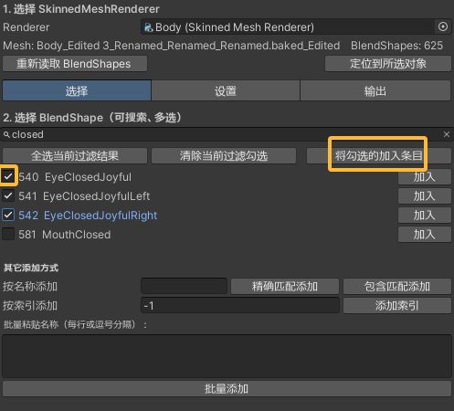

# Blendshape范围修改工具 使用说明

一个用于 **批量“限幅/缩放” BlendShape** 的 Unity 编辑器工具。  
它会把你选择的 BlendShape 的**形变幅度**按比例缩小（例如把“100% 等于旧的 65%”），
并**生成新的可写 Mesh 资产**（不改原 FBX），可选**自动挂回到原对象**。
适用于如下图过度闭眼的情况。

我们希望把EyeClosedJoyful=69.3的状态应用于100时。

---

## 功能一览

- **三页式顶部工具栏**：`选择` / `设置` / `输出`
- **可搜索、多选添加**：支持通配符 `*`、勾选加入
- **多种添加方式**：按名称（精确/包含）、按索引、批量粘贴名称
- **逐项比例**：每个条目设置“**新 100% = 旧 (%)**”
- **批量设定滑杆（持久）**：一键把所有条目改为同一百分比
- **一键烘焙**：重建所有 BlendShape 帧（**顶点/法线/切线**同步缩放）
- **安全回退**：记录原始 Mesh 路径，支持一键恢复
- **不改 FBX**：输出为项目内 `.asset` Mesh

---

## 环境与安装

- Unity **2019.4+**
- 将脚本保存为：`Assets/Editor/BlendshapeRangeBakerWindow.cs`
- 确保工程 **无编译错误**（Console 不应有红色错误）

---

## 打开方式

- 菜单：**Tools → Blendshape Range Baker**

> 打开后先在顶部“1. 选择 SkinnedMeshRenderer”里指定你的 SMR。

---

## 快速上手（1 分钟）

1. **选择 SMR**  
   在顶部选择需要处理的 `SkinnedMeshRenderer`。  
   可用按钮：
   - **重新读取 BlendShapes**：刷新当前 Mesh 的形态键列表  
   - **定位到所选对象**：在 Project/Hierarchy 中定位该对象

2. **选择（页签：选择）**  
   - 在搜索框输入关键词（支持 `*` 通配符），勾选需要的条目  
   - 点 **将勾选的加入条目**  
   - 也可以使用：
     - **按名称添加**：精确匹配 / 包含匹配  
     - **按索引添加**：输入 0…N-1  
     - **批量粘贴名称**：每行或逗号分隔（精确匹配）

3. **设置（页签：设置）**  
   - 在列表中为每个条目设置 **“新 100% = 旧 (%)”**（0–100）  
   - 查看 **缩放系数**（= 百分比 / 100）  
   - **批量设定**：拖动“批量设定”滑杆（**该值会记住**），点击 **应用到所有条目**  
   - 可随时删除某条条目

4. **输出（页签：输出）**  
   - 设置 **保存目录**（默认 `Assets/EditedMeshes`）  
   - 可勾选 **烘焙完成后自动挂回到原对象**  
   - 点击 **开始烘焙（生成新 Mesh）**  
   - 需要回退时，点击 **恢复到原始 Mesh**

---

最终效果：

## 三个页签详解

### ① 选择
- **搜索**：实时过滤；支持 `*` 通配（例如 `vrc.*blink*`）  
- **候选列表**：可滚动，逐项勾选；提供“全选当前过滤结果 / 清除当前过滤勾选”  
- **加入条目**：将勾选项加入待处理列表  
- **其它添加方式**：  
  - **按名称添加**（精确 / 包含）  
  - **按索引添加**  
  - **批量粘贴名称**：每行或逗号、分号、制表分隔（精确匹配）

### ② 设置
- 展示已加入的条目：`Index + 名称`  
- 每条可设置 **新 100% = 旧 (%)**，并显示对应 **缩放系数**  
- **批量设定**：使用“批量设定”滑杆（持久保存），点“应用到所有条目”

### ③ 输出
- **保存目录**：新 Mesh `.asset` 的保存路径（不存在会自动创建）  
- **烘焙完成后自动挂回到原对象**：把新 Mesh 回写到当前 SMR  
- **开始烘焙**：复制 Mesh → 读取所有帧 → 按条目缩放 `deltaVertices / deltaNormals / deltaTangents` → `ClearBlendShapes()` → 逐帧 `AddBlendShapeFrame()` → 保存资产  
- **恢复到原始 Mesh**：根据日志记录的路径一键还原

---

## 实现与效果说明

- **“新 100% = 旧 (%)”**：把该形态键**所有帧**的位移/法线/切线 **统一乘以** `比例/100`  
- **不改变**：BlendShape 的帧数量、各帧权重值与顺序（原动画插值手感保持）  
- **仅影响**：被加入条目的形态键；其他形态键不受影响  
- **输出**：生成新 Mesh `<源名>_Edited.asset` 到保存目录；原 FBX/导入资源不变  
- **回退日志**：保存目录下的 `_logs/<对象名>_originalMeshPath.txt`

---

## 注意事项与限制

- 本工具**只做幅度缩放**：不生成新形态、不拆左右、不改名称  
- 若你追求 ARKit 命名或新增左右，请配合其他工具（如 `SimpleBlendshapeRenamerWindow` 或在 DCC 中操作）  
- 大网格 / 多帧 BlendShape 烘焙会更慢，属正常

---

## 常见问题（FAQ）

**Q：按钮灰了？**  
A：先在“选择”页添加至少一个条目，再到“设置/输出”页操作。

**Q：烘焙后没变化？**  
A：确认动画/控制器驱动的就是这些形态键；若有多个 SMR，请确认当前使用的是你刚烘焙并（若勾选）自动挂回的 Mesh。

**Q：会影响光照吗？**  
A：不会。工具会同步缩放法线/切线的 delta，避免高光异常。

**Q：怎么回退？**  
A：到“输出”页点击 **恢复到原始 Mesh**，或在 SMR 的 **Mesh** 槽手动指回原始 Mesh。

**Q：窗口太长看不到底部？**  
A：本工具自带滚动与分页；若 UI 仍异常，可 `Window > Layouts > Default` 重置布局。

---

## 故障排查

- **菜单不显示**：脚本必须在 `Assets/Editor/`；Console 无红错；不被 asmdef 限制（或为该文件夹创建 Editor 平台 asmdef）；必要时 `Assets > Reimport All` 或重启 Unity。  
- **依旧报错或拖不动**：与本工具无直接关系；若启用了“无域重载快速进播放”，建议勾回 **Reload Domain** 以避免第三方静态缓存问题。

---

## 最佳实践

- 大改前先提交版本/备份，便于对比与回滚  
- 先少量条目测试效果，再批量处理  
- 做 iOS/ARKit 驱动时，常把强表情压到 **60%～70%**，更自然不失真

---
